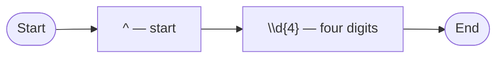
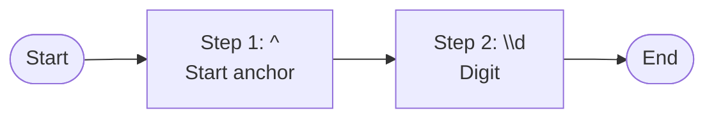

# PLAN.md — regex-lens

## Project Name

`regex-lens`

## Goal

Build a simple Python CLI application that reads one regular expression from a plaintext file and writes one Markdown explanation file.

The generated Markdown file must contain:

1. The original regex pattern.
2. A human-readable step-by-step explanation.
3. A Mermaid flowchart diagram embedded inside the Markdown.

This project intentionally has a narrow scope. It must not include regex testing, linting, JSON output, plaintext output, HTML output, interactive mode, web/API calls, AI-generated explanations, or extra optional commands.

---

## Product Summary

`regex-lens` helps a developer understand a regex by turning a dense regex pattern into readable Markdown documentation.

Example usage after installation from the local checkout:

```bash
regex-lens pattern.txt
```

Default output:

```text
./pattern.explanation.md
```

Custom output:

```bash
regex-lens pattern.txt --output explained.md
```

or:

```bash
regex-lens pattern.txt -o explained.md
```

---

## Scope

### In Scope

The first version must implement only the following:

- Read a regex pattern from a plaintext input file.
- Generate a Markdown explanation file.
- Include the original regex in a fenced `regex` code block.
- Include a summary section.
- Include a groups table.
- Include a step-by-step explanation table.
- Include a Mermaid flowchart in a fenced `mermaid` code block.
- Support a user-specified output file path through `--output` / `-o`.
- Use a default output file in the current working directory when `--output` is not provided.
- Use a simple deterministic parser/scanner written in Python.
- Use only Python standard library runtime dependencies.

### Out of Scope

Do not implement these features in this version:

- Regex sample testing.
- Regex linting.
- Regex performance analysis.
- Catastrophic backtracking detection.
- JSON output.
- Plaintext output.
- HTML output.
- Mermaid-only output.
- Multiple output formats.
- Interactive terminal UI.
- Web UI.
- AI-generated explanations.
- Calls to OpenAI or any external API.
- Reading from stdin.
- Multiple input files in one command.
- Repository-specific integrations.
- Language-specific regex execution or validation.

---

## CLI Contract

### Command

```bash
regex-lens INPUT_FILE [--output OUTPUT_FILE]
```

### Arguments

#### `INPUT_FILE`

Required.

Path to a plaintext file containing one regex pattern.

The file may contain:

- a one-line regex pattern
- a multi-line regex pattern
- comments or spacing if the regex itself uses verbose/free-spacing syntax

The application must preserve the input content as much as possible.

The application should remove only final trailing newline characters from the file content, because normal text files usually end with a newline. It must not strip leading spaces, internal spaces, tabs, or internal newlines.

Recommended behavior:

```python
pattern = raw_text.rstrip("\r\n")
```

Do not use `.strip()` because it could remove meaningful regex whitespace.

#### `--output`, `-o`

Optional.

Path to the Markdown file that should be written.

If not provided, write the file into the current working directory using this naming rule:

```text
<INPUT_FILE_STEM>.explanation.md
```

Examples:

| Input file | Default output file |
|---|---|
| `pattern.txt` | `./pattern.explanation.md` |
| `email.regex` | `./email.explanation.md` |
| `/tmp/log-line.txt` | `./log-line.explanation.md` |

Important: the default output directory is the current working directory, not necessarily the input file directory.

---

## Exit Codes

Use simple exit codes:

| Exit code | Meaning |
|---:|---|
| `0` | Success |
| `1` | Input/output error |
| `2` | Internal generation error |

Examples of exit code `1`:

- input file does not exist
- input path is a directory
- input file cannot be read
- output file cannot be written

Examples of exit code `2`:

- unexpected parser failure
- unexpected Markdown generation failure

---

## Repository Structure

Create this structure:

```text
regex-lens/
  PLAN.md
  README.md
  pyproject.toml
  src/
    regex_lens/
      __init__.py
      __main__.py
      cli.py
      model.py
      parser.py
      explainer.py
      mermaid.py
      markdown.py
  tests/
    test_parser.py
    test_markdown.py
    test_mermaid.py
    test_cli.py
  samples/
    date.regex
    log-line.regex
```

This project uses a `src/` layout. From a fresh checkout, the package is not importable from the repository root until it is installed or `PYTHONPATH=src` is set. The required development workflow is to install the package in editable mode before running `python -m regex_lens` or the `regex-lens` console script.

---

## Python Version

Use Python `3.14`.

Runtime dependencies: none outside the Python standard library.

Development/test dependencies can also be avoided by using `unittest` from the standard library.

---

## Packaging

Use `pyproject.toml`.

Minimal project metadata:

```toml
[project]
name = "regex-lens"
version = "0.1.0"
description = "CLI tool that explains regex patterns in Markdown with Mermaid diagrams."
readme = "README.md"
requires-python = ">=3.11"
dependencies = []

[project.scripts]
regex-lens = "regex_lens.cli:main"

[build-system]
requires = ["setuptools>=68"]
build-backend = "setuptools.build_meta"

[tool.setuptools]
package-dir = {"" = "src"}

[tool.setuptools.packages.find]
where = ["src"]
```

### Required Local Development Setup

From a fresh checkout, run this before manual module execution or tests:

```bash
python -m pip install -e .
```

After editable installation, these commands must work:

```bash
python -m regex_lens samples/date.regex
regex-lens samples/date.regex
```

Do not document `python -m regex_lens ...` as a fresh-checkout command unless the package has first been installed in editable mode or the command explicitly sets `PYTHONPATH=src`.

---

## Core Data Model

Implement simple dataclasses in `src/regex_lens/model.py`.

### `RegexStep`

Represents one explained regex element.

```python
from dataclasses import dataclass


@dataclass(frozen=True)
class RegexStep:
    index: int
    token: str
    kind: str
    description: str
    depth: int = 0
```

Field meanings:

| Field | Meaning |
|---|---|
| `index` | 1-based step number. |
| `token` | Original regex token or segment. |
| `kind` | Token category, such as `anchor`, `group_start`, `literal`, `quantifier`, or `inline_flags`. |
| `description` | Human-readable explanation. |
| `depth` | Parenthesis nesting depth at which this step appears. |

### `RegexGroup`

Represents a discovered regex group that introduces a nested scope.

Self-contained inline flag directives such as `(?i)` are not groups and must not create `RegexGroup` records.

```python
@dataclass(frozen=True)
class RegexGroup:
    index: int
    name: str | None
    kind: str
    depth: int
```

Supported group kinds:

- `capturing_group`
- `named_capturing_group`
- `non_capturing_group`
- `positive_lookahead`
- `negative_lookahead`
- `positive_lookbehind`
- `negative_lookbehind`
- `atomic_group`
- `scoped_flags_group`
- `unknown_special_group`

### `RegexExplanation`

Represents the full parser output.

```python
@dataclass(frozen=True)
class RegexExplanation:
    pattern: str
    steps: list[RegexStep]
    groups: list[RegexGroup]
```

---

## Parser Design

Implement `parse_regex(pattern: str) -> RegexExplanation` in `parser.py`.

The parser should be a deterministic scanner. It does not need to build a complete formal regex AST and it must not execute the regex.

The parser must walk through the pattern from left to right and produce ordered `RegexStep` entries.

### Parser State

Track:

```python
i: int                     # current character index
depth: int                 # current group nesting depth
steps: list[RegexStep]
groups: list[RegexGroup]
group_stack: list[str]     # group kinds currently open
capture_count: int         # count numbered capturing groups
```

Depth rules:

- Normal group starts increase `depth` by 1.
- Group-start steps and group records use the new depth after incrementing.
- Closing `)` steps use the current depth before decrementing.
- Closing `)` reduces `depth` by 1 only if a group is currently open.
- Self-contained inline flag directives such as `(?i)` do not increase depth and do not expect a later closing `)`.
- Depth must never become negative.

### Recognition Order

At each character position, use this order:

1. Character class starting with unescaped `[`. Consume the full class.
2. Group starts or inline flag directives starting with unescaped `(`.
3. Closing `)`.
4. Escaped tokens starting with `\`.
5. Braced quantifier starting with `{` when it looks like `{m}`, `{m,}`, or `{m,n}`.
6. Single-character quantifier: `*`, `+`, or `?`, including lazy or possessive suffix.
7. Anchors: `^` and `$`.
8. Alternation: `|`.
9. Wildcard dot: `.`.
10. Literal text aggregation.

This order avoids treating the `?` inside `(?i)`, `(?:...)`, or `(?=...)` as a quantifier.

### Token Types to Recognize

The parser must recognize these common regex components.

#### Anchors

| Token | Explanation |
|---|---|
| `^` | Start of string or line, depending on regex mode. |
| `$` | End of string or line, depending on regex mode. |
| `\A` | Start of string. |
| `\Z` | End of string. |
| `\z` | Absolute end of string in regex engines that support it. |
| `\b` | Word boundary. |
| `\B` | Not a word boundary. |

#### Character Shortcuts

| Token | Explanation |
|---|---|
| `\d` | A digit character. |
| `\D` | A non-digit character. |
| `\w` | A word character. |
| `\W` | A non-word character. |
| `\s` | A whitespace character. |
| `\S` | A non-whitespace character. |
| `.` | Any character except newline, depending on regex mode. |

#### Escaped Whitespace

| Token | Explanation |
|---|---|
| `\n` | Newline character. |
| `\r` | Carriage return character. |
| `\t` | Tab character. |

#### Escaped Literals

For an escaped literal such as `\.` or `\+`, explain that it matches the literal character.

Example:

```text
\. matches a literal dot.
```

#### Character Classes

Recognize complete character classes:

```regex
[abc]
[a-z]
[^0-9]
[A-Za-z0-9_]
```

Rules:

- A character class starts at an unescaped `[`. 
- It ends at the next unescaped `]`.
- Preserve the full class as one token.
- If it starts with `[^`, describe it as a negated character class.
- Otherwise describe it as a character class matching one character from the listed set/range.
- Do not attempt deep parsing of every range inside the class in version 1.
- If a closing `]` is not found, emit one `literal` step with token `[` and continue scanning immediately after that `[`.
- An unterminated character class must not emit a `character_class` step.

#### Groups and Inline Flags

There are two separate categories:

1. **Groups** introduce a nested scope and are later closed by `)`.
2. **Self-contained inline flag directives** are complete tokens and do not introduce a nested scope.

When the scanner sees an unescaped `(?`, apply this detection order:

1. Self-contained inline flag directive such as `(?i)`.
2. Scoped inline-flags group such as `(?imx:...)`.
3. Known special group start such as `(?:`, `(?=`, or `(?<name>`.
4. Unknown special group fallback.

##### Group Starts

Recognize these group starts:

| Syntax | Kind | Opens scope? | Explanation |
|---|---|---:|---|
| `(` | `capturing_group` | yes | Starts a capturing group. |
| `(?:` | `non_capturing_group` | yes | Starts a non-capturing group. |
| `(?P<name>` | `named_capturing_group` | yes | Starts a Python-style named capturing group. |
| `(?<name>` | `named_capturing_group` | yes | Starts a .NET/PCRE-style named capturing group. |
| `(?'name'` | `named_capturing_group` | yes | Starts an alternate named capturing group. |
| `(?=` | `positive_lookahead` | yes | Starts a positive lookahead assertion. |
| `(?!` | `negative_lookahead` | yes | Starts a negative lookahead assertion. |
| `(?<=` | `positive_lookbehind` | yes | Starts a positive lookbehind assertion. |
| `(?<!` | `negative_lookbehind` | yes | Starts a negative lookbehind assertion. |
| `(?>` | `atomic_group` | yes | Starts an atomic group. |
| `(?i:` | `scoped_flags_group` | yes | Starts a scoped inline-flags group. |
| `(?imx:` | `scoped_flags_group` | yes | Starts a scoped inline-flags group. |
| `(?i-m:` | `scoped_flags_group` | yes | Starts a scoped inline-flags group with enabled and disabled flags. |
| any other unrecognized `(?` form | `unknown_special_group` | yes | Starts an unrecognized special group form. |

##### Fallback Rule for Unknown Special Groups

After checking self-contained inline flag directives, scoped inline-flags groups, and all known special group starts, any remaining unescaped construct that starts with `(?` must be handled as an `unknown_special_group`.

Required behavior:

- Emit a `RegexStep` with kind `group_start` and a description such as `Starts an unrecognized special regex group.`
- Emit a `RegexGroup` with kind `unknown_special_group`, `name = None`, and the new incremented depth.
- Increment `depth` by `1` and push `unknown_special_group` onto `group_stack`.
- If a `:` appears before the next unescaped `)`, consume the group-start token through the `:`. Example: `(?foo:abc)` emits group-start token `(?foo:`.
- If `)` appears before any `:`, consume the group-start token up to but not including `)`. Example: `(?foo)` emits group-start token `(?foo`; the generic closing-parenthesis rule then emits the `group_end` step for `)`.
- If neither `:` nor `)` appears, consume the rest of the pattern as the group-start token and leave the group open. The parser is explanatory, not a validator.
- Do not treat the unknown opener as a normal capturing group.
- Do not treat the unknown opener as literal text.
- Do not crash or try to validate the unknown syntax.
- Do not treat `(?foo)` as `inline_flags`, because `foo` is not a valid inline flag specification for this project.

Examples that must use this fallback in version 1:

```regex
(?foo)
(?#comment)
(?foo:abc)
```

This fallback makes depth tracking deterministic for unrecognized `(?...)` constructs, including comment-like forms that are not otherwise modeled in version 1.

For closing `)`, add a `group_end` step describing that the current group ends, then reduce nesting depth by one.

If `)` appears when no group is open, add a step with kind `unmatched_closing_parenthesis` and keep depth at `0`. The parser is explanatory, not a validator.

##### Self-Contained Inline Flag Directives

Recognize inline flag directives like these:

| Syntax | Kind | Opens scope? | Explanation |
|---|---|---:|---|
| `(?i)` | `inline_flags` | no | Applies inline regex flags from this point. |
| `(?im)` | `inline_flags` | no | Applies multiple inline regex flags from this point. |
| `(?-i)` | `inline_flags` | no | Disables an inline regex flag from this point in engines that support it. |
| `(?i-m)` | `inline_flags` | no | Enables and disables inline regex flags from this point in engines that support it. |

Important rule:

- `(?i)` is consumed as one complete token.
- It must not be pushed to `group_stack`.
- It must not increment `depth`.
- Its closing `)` is part of the inline flag token and must not be handled by the generic closing-parenthesis rule.

##### Inline Flag Detection Rule

When the scanner sees `(?`, inspect the characters after `?` until either `)` or `:` is found.

For version 1, the supported inline flag letters are:

```text
A a i L m n s u x
```

A valid inline flag specification is one of these forms:

```text
flags
-flags
flags-flags
```

where `flags` is one or more supported flag letters.

Rules:

- If a `)` appears before any `:` and the content between `?` and `)` is a valid inline flag specification, treat the whole token as `inline_flags`.
- If a `:` appears before any `)` and the content between `?` and `:` is a valid inline flag specification, treat the token through `:` as a `scoped_flags_group` start.
- If the content contains unsupported flag letters, do not treat it as `inline_flags` or `scoped_flags_group`.
- A token such as `(?-)` must not be treated as `inline_flags`, because it contains no flag letters.
- Otherwise, continue checking the other special group syntaxes and the fallback rules above.

This rule keeps `(?i)` and `(?imx:...)` behavior distinct, while preventing unknown constructs such as `(?foo)` from being misclassified as inline flags.

#### Alternation

Recognize:

```regex
|
```

Explain as:

```text
Alternation: matches the expression on the left or the expression on the right.
```

#### Quantifiers

Recognize:

| Token | Explanation |
|---|---|
| `*` | Zero or more repetitions. |
| `+` | One or more repetitions. |
| `?` | Zero or one repetition. |
| `{m}` | Exactly `m` repetitions. |
| `{m,}` | At least `m` repetitions. |
| `{m,n}` | Between `m` and `n` repetitions. |

Also recognize lazy and possessive suffixes when present:

| Token | Meaning |
|---|---|
| `*?`, `+?`, `??`, `{m,n}?` | Lazy/non-greedy quantifier. |
| `*+`, `++`, `?+`, `{m,n}+` | Possessive quantifier in engines that support it. |

Rules:

- A braced quantifier may contain only digits and at most one comma between the braces.
- A braced sequence that does not match `{m}`, `{m,}`, or `{m,n}` must be treated as literal text, not as a quantifier.
- If an invalid braced sequence has a closing `}`, emit one `literal` step from `{` through that `}`. For example, `{foo}` and `{2,x}` are literal tokens.
- If an invalid braced sequence has no closing `}`, emit one `literal` step with token `{` and continue scanning immediately after that `{`.
- Lazy or possessive suffixes are part of the quantifier token.

#### Literals

Aggregate consecutive ordinary literal characters into a single `literal` step.

Example:

```regex
ERROR
```

Should become one step:

```text
`ERROR` — matches the literal text `ERROR`.
```

This keeps the explanation readable for large regexes.

---

## Explanation Rules

Implement explanation logic in `explainer.py` or directly in parser helper functions.

Descriptions should be direct and practical.

Examples:

| Token | Kind | Description |
|---|---|---|
| `^` | `anchor` | Matches the start of the string or line, depending on regex mode. |
| `\d` | `character_shortcut` | Matches a digit character. |
| `{4}` | `quantifier` | Repeats the previous token exactly 4 times. |
| `(?<date>` | `group_start` | Starts a named capturing group called `date`. |
| `(?i)` | `inline_flags` | Applies inline regex flags from this point. |
| `(?imx:` | `group_start` | Starts a scoped inline-flags group. |
| `(?foo` | `group_start` | Starts an unknown or engine-specific special group. |
| `)` | `group_end` | Ends the current group. |
| `|` | `alternation` | Separates alternatives; the regex can match the expression on either side. |
| `[A-Z]` | `character_class` | Matches one character from the character class `[A-Z]`. |
| `[^,]` | `character_class` | Matches one character not in the character class `[^,]`. |

---

## Markdown Output Design

Implement `render_markdown(explanation: RegexExplanation, input_path: Path) -> str` in `markdown.py`.

The generated file must use this structure:

````markdown
# Regex Explanation

## Source

`pattern.txt`

## Pattern

```regex
...
```

## Summary

- Steps: N
- Groups: N
- Named groups: N
- Alternations: N
- Quantifiers: N

## Groups

| # | Name | Kind | Depth |
|---:|---|---|---:|
| 1 | date | named_capturing_group | 1 |

## Step-by-step Explanation

| # | Depth | Token | Type | Explanation |
|---:|---:|---|---|---|
| 1 | 0 | `^` | anchor | Matches the start of the string or line, depending on regex mode. |

## Mermaid Diagram


````

### Markdown Escaping Requirements

Escape table content safely:

- Replace `|` with `\|` inside table cells.
- Replace real newlines with the two-character string `\n` inside table cells.
- Wrap tokens in backticks when possible.
- If a token contains a backtick, replace backticks with escaped backticks or avoid code formatting for that token.
- Escape backslashes as needed only when required for Markdown readability; do not alter the original regex shown in the fenced `regex` block.

The Markdown should be readable in GitHub.

---

## Mermaid Output Design

Implement `render_mermaid(explanation: RegexExplanation) -> str` in `mermaid.py`.

Use a simple left-to-right flowchart.

Recommended format:



### Mermaid Requirements

- The first line must be `flowchart LR`.
- Every explanation step becomes one Mermaid node.
- Nodes are connected in step order.
- Include `Start` and `End` nodes.
- Use stable node IDs: `N0`, `N1`, `N2`, etc.
- Escape double quotes in labels.
- Replace newlines in labels with spaces or `<br/>`.
- Limit each label to a safe length, for example 80 characters.
- Do not create advanced branch diagrams in version 1.

The diagram is explanatory, not a full automaton or full regex execution graph.

---

## CLI Implementation Details

Implement `main(argv: list[str] | None = None) -> int` in `cli.py`.

Use `argparse`.

CLI behavior:

1. Parse arguments.
2. Resolve input path.
3. Read input text using UTF-8.
4. Remove final trailing CR/LF characters only.
5. Parse the regex into `RegexExplanation`.
6. Render Markdown.
7. Determine output path.
8. Write Markdown using UTF-8.
9. Print one success line.
10. Return exit code `0`.

Success output example:

```text
Wrote regex explanation to ./pattern.explanation.md
```

Error output should go to stderr.

Input read error example:

```text
Error: cannot read input file: pattern.txt
```

Output write error example:

```text
Error: cannot write output file: explained.md
```

### Default Output Path Function

Implement a helper:

```python
from pathlib import Path


def default_output_path(input_path: Path, cwd: Path | None = None) -> Path:
    cwd = cwd or Path.cwd()
    return cwd / f"{input_path.stem}.explanation.md"
```

---

## `__main__.py`

Allow this command after editable installation or when `PYTHONPATH=src` is set:

```bash
python -m regex_lens pattern.txt
```

Implementation:

```python
from .cli import main

raise SystemExit(main())
```

Because the project uses a `src/` layout, this module command is not expected to work from a fresh checkout until the package has been installed in editable mode.

---

## README Requirements

Create a short `README.md` with:

- project description
- local development setup with `python -m pip install -e .`
- CLI usage
- input file example
- output file example
- generated Markdown example
- note that the first version explains common regex syntax and produces a simple left-to-right Mermaid flowchart

Keep the README concise.

---

## Samples

Create `samples/date.regex`:

```regex
^\d{4}-\d{2}-\d{2}$
```

Create `samples/log-line.regex`:

```regex
^(?<date>\d{4}-\d{2}-\d{2})\s+(?<level>INFO|WARN|ERROR):\s+(?<message>.*)$
```

---

## Test Plan

Use Python standard library `unittest`.

The tests must cover the parser features promised in this plan. Do not leave required parser behavior untested.

### `tests/test_parser.py`

Test these cases:

1. Date regex:

```regex
^\d{4}-\d{2}-\d{2}$
```

Expected:

- contains anchor step for `^`
- contains shortcut step for `\d`
- contains quantifier step for `{4}`
- contains literal step for `-`
- contains anchor step for `$`

2. Extended anchors, shortcuts, and wildcard dot:

```regex
\A\b\B\D\w\W\s\S.\Z\z
```

Expected:

- contains anchor steps for `\A`, `\b`, `\B`, `\Z`, and `\z`
- contains character shortcut steps for `\D`, `\w`, `\W`, `\s`, and `\S`
- contains wildcard dot step for `.`

3. Named group syntaxes:

```regex
(?P<date>\d{4})(?<level>INFO)(?'message'.*)
```

Expected:

- three groups exist
- group names are `date`, `level`, and `message`
- all three group kinds are `named_capturing_group`
- closing group steps are present
- depth returns to `0` after parsing

4. Non-capturing, lookaround, and atomic groups:

```regex
(?:abc)(?=def)(?!ghi)(?<=jkl)(?<!mno)(?>pqr)
```

Expected:

- contains `non_capturing_group`
- contains `positive_lookahead`
- contains `negative_lookahead`
- contains `positive_lookbehind`
- contains `negative_lookbehind`
- contains `atomic_group`

5. Inline flag directive is not a group:

```regex
(?i)^abc$
```

Expected:

- contains one `inline_flags` step with token `(?i)`
- creates no group for `(?i)`
- `^` and `$` steps have depth `0`
- there is no `group_end` step for the `)` inside `(?i)`

6. Scoped inline-flags group is a group:

```regex
(?imx:abc)
```

Expected:

- contains one group of kind `scoped_flags_group`
- group depth is `1`
- contains a `group_end` step
- depth returns to `0` after parsing

7. Alternation and literal aggregation:

```regex
INFO|WARN|ERROR
```

Expected:

- contains alternation steps
- literal chunks are aggregated as `INFO`, `WARN`, and `ERROR`

8. Character classes:

```regex
^[A-Z][^,]+$
```

Expected:

- contains `[A-Z]` character class
- contains `[^,]` negated character class
- contains `+` quantifier

9. Escaped whitespace and escaped literals:

```regex
\n\r\t\.\+\(\)
```

Expected:

- contains escaped whitespace steps for `\n`, `\r`, and `\t`
- contains escaped literal steps for `\.`, `\+`, `\(`, and `\)`

10. Lazy and possessive quantifiers:

```regex
a*?b++c{2,4}?d{3}+e??f?+
```

Expected:

- contains quantifier token `*?`
- contains quantifier token `++`
- contains quantifier token `{2,4}?`
- contains quantifier token `{3}+`
- contains quantifier token `??`
- contains quantifier token `?+`

11. Group closing depth behavior:

```regex
(a(?:b)c)
```

Expected:

- outer capturing group has depth `1`
- inner non-capturing group has depth `2`
- group-end steps reduce depth correctly
- no step has negative depth

12. Unmatched closing parenthesis:

```regex
abc)
```

Expected:

- contains an `unmatched_closing_parenthesis` step
- no step has negative depth

13. Multi-line pattern preservation:

```regex
(?x)
^ foo
$
```

Expected:

- explanation pattern equals the original multi-line string passed to `parse_regex`
- contains one `inline_flags` step for `(?x)`
- parser does not strip internal newlines

14. Unknown special group fallback:

```regex
(?foo)abc(?#comment)
```

Expected:

- contains two groups with kind `unknown_special_group`
- contains `group_start` steps with tokens `(?foo` and `(?#comment`
- contains `group_end` steps for the closing `)` characters
- does not classify either unknown opener as `inline_flags`
- does not classify either unknown opener as a normal `capturing_group`
- depth returns to `0` after parsing
- no step has negative depth

15. Unterminated character class falls back to literal text:

```regex
abc[def
```

Expected:

- parser does not crash
- no `character_class` step is emitted for `[def`
- a `literal` step with exact token `[` is emitted
- scanning continues after `[` so the trailing literal text is preserved in the explanation
- no step has negative depth

16. Invalid braced sequences fall back to literal text:

```regex
a{,3}b{2,x}c{2,,3}d{abc}e{4
```

Expected:

- parser does not crash
- `{,3}` is not emitted as a `quantifier`
- `{2,x}` is not emitted as a `quantifier`
- `{2,,3}` is not emitted as a `quantifier`
- `{abc}` is not emitted as a `quantifier`
- literal steps include exact tokens `{,3}`, `{2,x}`, `{2,,3}`, and `{abc}`
- the unterminated `{4` sequence emits a literal step with exact token `{`
- no step has negative depth

### `tests/test_markdown.py`

Verify generated Markdown contains:

- `# Regex Explanation`
- `## Source`
- `## Pattern`
- fenced `regex` block
- `## Summary`
- `## Groups`
- `## Step-by-step Explanation`
- `## Mermaid Diagram`
- fenced `mermaid` block
- `flowchart LR`

Also test Markdown table escaping:

- a token containing `|` is escaped as `\|` inside the table
- a token containing a real newline is rendered as `\n` inside the table
- the original pattern inside the fenced `regex` block is not table-escaped

### `tests/test_mermaid.py`

Verify:

- Mermaid output starts with `flowchart LR`
- includes `N0([Start])`
- includes an end node
- creates one node per explanation step
- connects nodes in order
- escapes double quotes in labels
- replaces real newlines in labels

### `tests/test_cli.py`

Use a temporary directory.

Test:

1. Default output path:

```bash
regex-lens /tmp/pattern.txt
```

Expected output file in current working directory:

```text
./pattern.explanation.md
```

2. Custom output path:

```bash
regex-lens /tmp/pattern.txt --output /tmp/out.md
```

Expected:

```text
/tmp/out.md
```

3. Missing input file returns exit code `1`.

4. Multi-line input file preserves internal newlines in the generated fenced `regex` block.

5. Input reader removes only final trailing CR/LF characters and does not strip leading spaces or internal whitespace.

---

## Manual Verification Commands

From a fresh checkout, run editable installation first:

```bash
python -m pip install -e .
```

Then run:

```bash
python -m regex_lens samples/date.regex
```

```bash
python -m regex_lens samples/log-line.regex -o log-line.explanation.md
```

```bash
regex-lens samples/date.regex
```

```bash
regex-lens samples/log-line.regex -o log-line.explanation.md
```

```bash
python -m unittest discover -s tests
```

Expected generated files:

```text
./date.explanation.md
./log-line.explanation.md
```

---

## Acceptance Criteria

The implementation is complete when all of the following are true:

1. `regex-lens INPUT_FILE` reads a plaintext regex file.
2. Without `--output`, the tool writes `<input-stem>.explanation.md` in the current working directory.
3. With `--output`, the tool writes to the exact user-specified path.
4. The generated Markdown includes the original regex pattern in a fenced `regex` block.
5. The generated Markdown includes a summary section.
6. The generated Markdown includes a groups table.
7. The generated Markdown includes a step-by-step explanation table.
8. The generated Markdown includes a Mermaid flowchart inside a fenced `mermaid` code block.
9. The Mermaid flowchart uses `flowchart LR`.
10. The Mermaid flowchart includes Start and End nodes.
11. The Mermaid flowchart includes one node per explanation step.
12. The parser recognizes anchors, character shortcuts, escaped whitespace, escaped literals, character classes, group starts, group ends, self-contained inline flag directives, scoped inline-flags groups, unknown special groups, alternation, quantifiers, lazy quantifiers, possessive quantifiers, wildcard dot, and literal text.
13. Self-contained inline flag directives such as `(?i)` do not create group records and do not change nesting depth.
14. Scoped inline-flags groups such as `(?i:abc)` create group records and are closed by `)`.
15. Unknown constructs such as `(?foo)` and `(?#comment)` create `unknown_special_group` records, increase nesting depth, and are closed by the generic closing-parenthesis rule instead of being misclassified as inline flags, normal capturing groups, or literal openers.
16. Unterminated character classes fall back to literal steps as specified.
17. Invalid braced sequences fall back to literal steps as specified.
18. The parser never emits a negative depth.
19. The CLI returns exit code `0` on success.
20. The CLI returns exit code `1` for input/output errors.
21. Unit tests cover every parser feature required by this plan, including unknown special group fallback, unterminated character class literal fallback, and invalid braced sequence literal fallback.
22. Unit tests pass with `python -m unittest discover -s tests` after `python -m pip install -e .`.
23. The project has no runtime dependencies outside the Python standard library.

---

## Implementation Order for Codex

Follow this order exactly:

1. Create repository structure.
2. Create `pyproject.toml` with the `src/` layout configuration.
3. Create `model.py` dataclasses.
4. Create `parser.py` with deterministic scanner.
5. Create `mermaid.py` renderer using `flowchart LR`.
6. Create `markdown.py` renderer.
7. Create `cli.py` with argparse-based CLI.
8. Create `__main__.py`.
9. Create sample regex files.
10. Create `README.md`.
11. Create unit tests, including parser coverage for all required token types.
12. Run `python -m pip install -e .`.
13. Run `python -m unittest discover -s tests`.
14. Fix parser, Mermaid escaping, Markdown escaping, or CLI path issues until tests pass.

Do not add features outside this plan.
